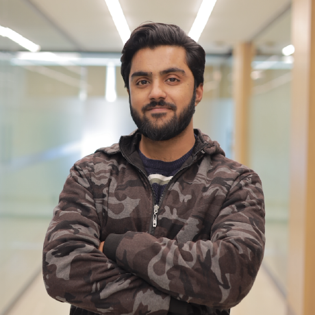
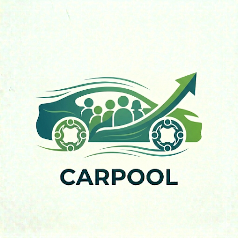
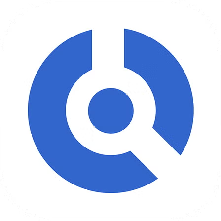
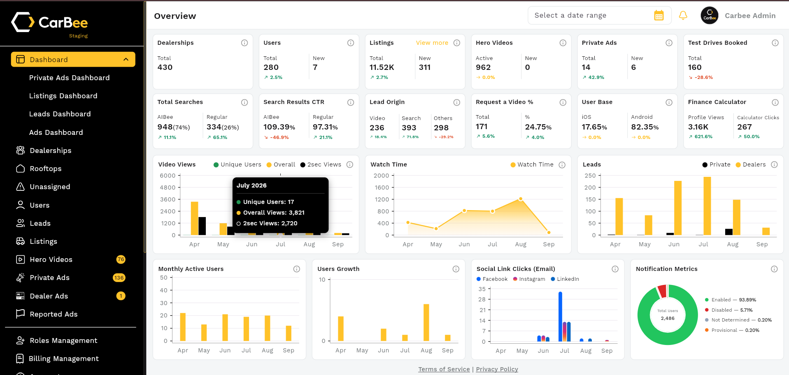
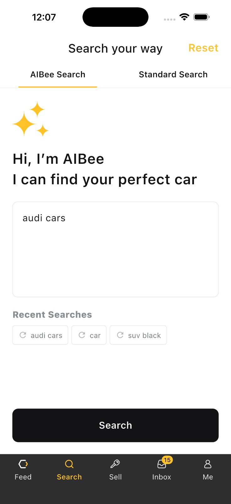
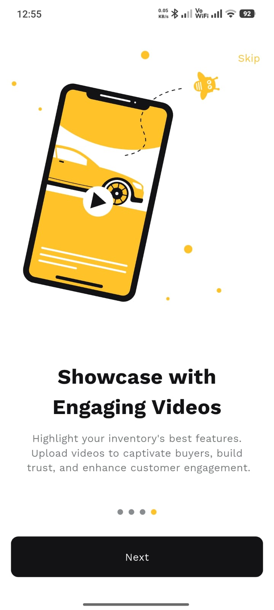

# Muhammad Ikram Ul Haq
### Flutter & Native iOS Engineer · Tech Lead

I build apps and help teams build better.

[Email](mailto:emikramulhaq@gmail.com) · [LinkedIn](https://www.linkedin.com/in/em-ikram-a718a9145/) · [GitHub](https://github.com/EMIkram)

**Islamabad, Pakistan** · Mobile & Web · Product Engineering

---

## Engineering with ownership

I take products from an initial idea through implementation and release. My work spans automotive platforms, healthcare, shared mobility, commerce, and service applications. I’ve delivered projects independently and led teams through several more.

I care about maintainable architecture, dependable releases, and the details that make an application feel good to use.

## Toolkit

| Focus | Technologies & practices |
| :--- | :--- |
| Mobile & web | Flutter, Dart, native iOS |
| Application architecture | BLoC / Cubit, reusable components, shared design systems |
| Delivery | Firebase, CI/CD, multi-environment releases |
| AI-enabled workflows | AI-assisted development, AI feature integration |
| Technical leadership | Code review, mentoring, implementation ownership |

## Selected work

<table>
<tr><td width="64"></td><td><b>Carbee</b> Automotive discovery and dealership operations across mobile and web. Primary ownership of admin and dealer portals, alongside technical leadership and shared foundations. <a href="https://carbee.com.au">Website</a> · <a href="https://play.google.com/store/apps/details?id=com.carbee.user.prod">Android</a> · <a href="https://apps.apple.com/au/app/carbee-au/id6474963233">iOS</a></td></tr>
<tr><td></td><td><b>Carpool</b> Shared journeys and everyday mobility. <a href="https://play.google.com/store/apps/details?id=com.carpoolingpk.carpool">Android</a></td></tr>
<tr><td></td><td><b>Dr. iQ</b> Digital healthcare, appointments, and online consultations. Native iOS development and refactoring.</td></tr>
<tr><td></td><td><b>Ayuda Health</b> Connected health tracking and everyday care. <a href="https://ayudahealth.com/">Website</a></td></tr>
<tr><td></td><td><b>My Treats</b> Restaurant ordering and delivery for Bristol. Mobile application work. <a href="https://apps.apple.com/gb/app/my-treats/id1553674065">iOS</a> · <a href="https://mytreatsbristol.co.uk/">Restaurant website</a></td></tr>
<tr><td></td><td><b>LSUK</b> Language interpretation workflows connecting interpreters with available jobs. <a href="https://play.google.com/store/apps/details?id=com.org.lsuk">Android</a> · <a href="https://apps.apple.com/us/app/lsuk/id1545528069">iOS</a></td></tr>
<tr><td></td><td><b>Whatsinit</b> A mobile product built from the ground up.</td></tr>
</table>

<b>A closer look at Carbee</b>

 

&nbsp;&nbsp;

**Other products:** Shirleys · Load a Trash · Muslim World 360 · Invoice Labs · Family Tutor · Afterlife AI · Cam Translator · AMS · SternaSearch

## Experience

| Period | Company | Role |
| :--- | :--- | :--- |
| Mar 2024 – Present | Techtronix | Tech Lead — Flutter & Mobile/Web Engineering |
| Jun 2022 – Mar 2024 | AT-Tech | Software Engineer · Flutter & iOS |
| Jan 2022 – Jun 2022 | Heuristify | Flutter Developer |
| Nov 2020 – Jan 2022 | SBS | Associate Software Engineer |
| Aug 2019 – Sep 2020 | Independent | Freelance development |

**BS Computer Science** · FUUAST, Islamabad · 2016–2020 · CGPA 3.59

---

### Have a product in mind?
[Let’s connect](mailto:emikramulhaq@gmail.com) · [Find me on LinkedIn](https://www.linkedin.com/in/em-ikram-a718a9145/)

